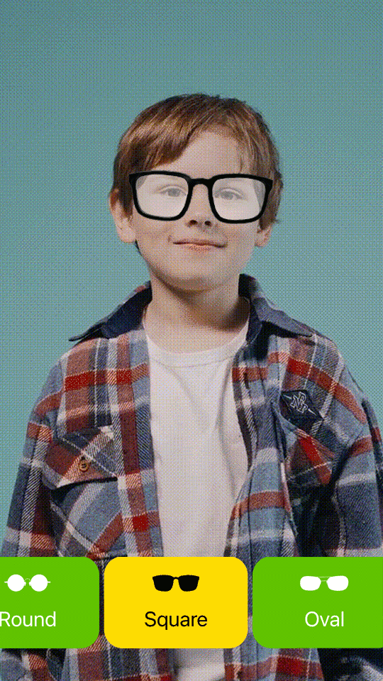

# Glass-Fit

Glass-Fit is an open-source iOS app demo that showcases the power of RealityKit in making 3D overlays effortless using Reality Composer. The app allows users to overlay 3D glasses over their face using augmented reality.

## Features

- Overlay 3D glasses over your face using RealityKit and SwiftUI.
- Utilizes Combine to efficiently manage asynchronous data streams and user interactions.
- Easily customize and extend the app to add your own 3D glasses designs or experiment with different AR experiences by editing the [Experience.rcproject](Glass-Fit/Glass-Fit/Resources/Experience.rcproject/) file.

## Screenshot



## Requirements

- iOS 16.0+
- Xcode 14.0+

## Used Stack
- Swift
- SwiftUI
- Combine
- RealityKit

## Getting Started

### Prerequisites

This is a RealityKit app that can only run on a real device. To run it on your device, make sure to change the [Config.xcconfig](Glass-Fit/Config.xcconfig) file.

### Configuration

In the [Config.xcconfig](Glass-Fit/Config.xcconfig) file, replace the following placeholders with your own values:

```swift
// Replace with your own bundle identifier
PRODUCT_BUNDLE_IDENTIFIER = com.yourcompany.glass-fit

// Replace with your own team id
DEVELOPMENT_TEAM = XXXX
```

## Installation

1. Clone the repository.
2. Open the project in Xcode.
3. Build and run on your device.

## License

Glass-Fit is released under the [GNU General Public License v3.0](LICENSE).

